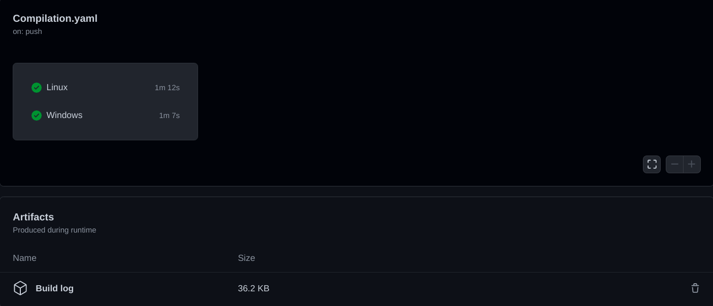
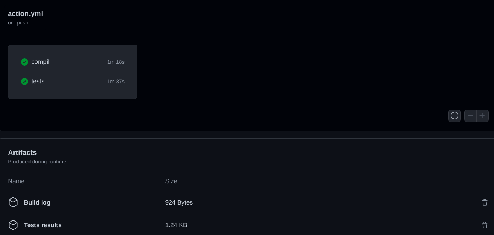
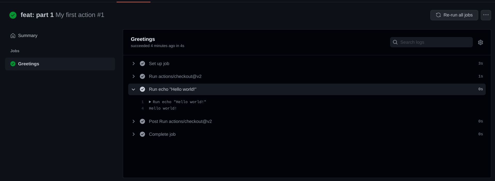
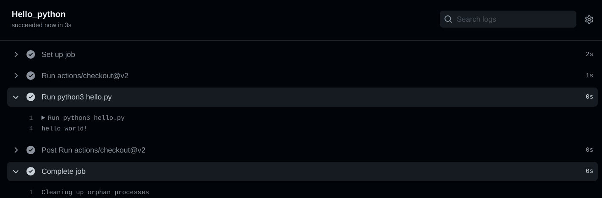
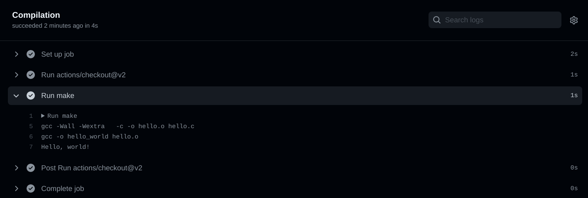
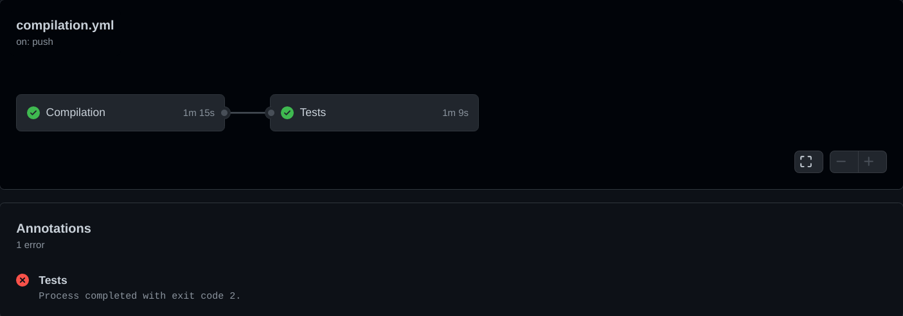
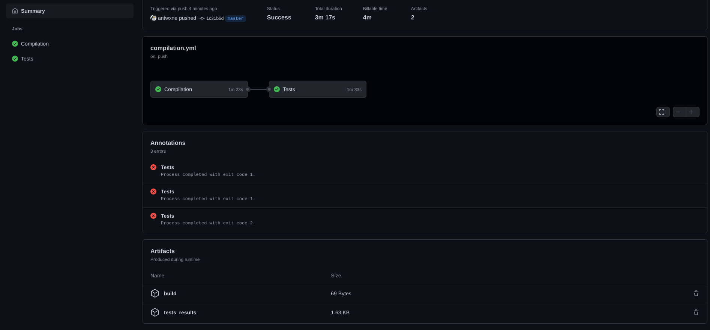

# Workshop GitHub action 

## Introduction

Les github action permettent de lancer une série d'actions lors d'un évènement sur un repertoire github.

Comme par example verifier si le projet compile bien, ou encore lancer une batterie de tests sur le projet.





Au cours de ce workshop vous allez voir comment faire un workflow qui vérifie que le projet compile correctement et aussi lancer des tests sur le projet.

## Premiers pas

### Découverte
Dans cette partie vous allez vous familiariser avec la façon d'écrire des github actions.

Pour commencer vous devez avoir un fichier se terminant par `.yml` situé dans un dossier `.github/workflows`.

```shell
$> ls .github/workflows/
action.yml
```
À l'aide de la documentation des [github actions](https://docs.github.com/en/actions) et celle des [workflows](https://docs.github.com/en/actions/learn-github-actions/workflow-syntax-for-github-actions) créez une action qui:

- S'appelle `My first action`.
- Se lance lors d'un push sur la branche `master`.
- A un `job` s'appelant `Greetings`.
  - Se lance sur la dernière version d'Ubuntu
  - Ce job doit utiliser `actions/checkout@v2` et afficher `Hello world!` dans la console.

Pushez vos modifications sur la branche master.

Vous devriez avoir le résultat suivant:



Si tout fonctionne vous pouvez maintenant ajouter quelques commandes dans votre action.

Dans le meme job que précédemment. 

Dans le meme `run` que la partie précédente:
- Créez un dossier `Plop`
- Listez tous les fichiers du répertoire et placez l'output dans un fichier.
- Déplacez ce fichier dans le dossier `Plop`.
- Listez les fichiers situés dans `Plop`.


#### Autre chose que Linux pour lancer ses actions

Les github action permettent de lancer les actions sur différents systèmes d'exploitation.
C'est ce que nous allons voir maintenant.

Créez un nouveau fichier `.yml` dans `.github/workflows`

Ce workflow devra avoir les caractéristiques suivantes:
- S'appeller `Multi OS`
- Se lance lors d'un push sur la branche `master`.
- A un `job` s'appelant `WinduntuOS`:
  - Se lançant sur les dernieres versions d'Ubuntu, Windows et MacOs.
  - affichant `Hello from < nom de l'os >` dans la console.

> Pour cette partie regardez ce qu'est une `matrix`.

## Executer un programme

Pour cette partie vous devrez executer le script `hello.py`, qui est situé dans `app/python`.

> Vous lancerez le script avec la commande suivante `python3 hello.py`.

Créez un nouveau `Jobs` dans `action.yml`.

Vous appellerez ce jobs `Hello_python` et il aura les caractéristiques suivantes:

- Se lancer lors d'un push
- Tourner sur `ubuntu_latest`
- Utiliser `actions/checkout@v2`
- Lancer le script python

Vous devriez avoir le resultat suivant:



## Compilation

Maintenant que vous êtes un peu plus à l'aise avec les github actions, vous allez voir comment vous pouvez vous en servir pour vos projets.

Commencez par créer un nouveau fichier `compilation.yml`.

### Simple compilation

Vous pourrez retrouver dans `app/c` un `Makefile` qui compile un programme nommé `hello_world`.

Dans cette partie, vous allez compiler le projet et l'exécuter.

Dans le ficher `compilation.yml` créez un nouveau `Workflow` nommé `Compilation`.

Ce workflow devra:

- Se lancer lors d'un `push` sur n'importe quelle branche.
- Se lancer lors d'une `pull request` sur la branche `master`.
- Avoir un `jobs` nommé `Compilation`.
- Se lancer sur `ubuntu_latest`.
- Utiliser `actions/checkout@v2`.
- Faire `make` et lancer votre programme.

Vous devriez avoir le résultat suivant:



### Compilation conteneurisée

Maintenant que vous avez réussi à compiler votre programme, vous allez devoir le compiler dans un environnement particulier.

Pour ce faire nous allons utiliser _Docker_, ainsi que l'image utilisée par la moulinette.
Ainsi vous pourrez vérifier que votre programme fonctionne bien dans les memes conditions que celles des tests.

Réutilisez le job précédent et faites en sorte qu'il utilise l'image `epitechcontent/epitest-docker`.

Ensuite compilez et lancez le programme.

## Tests

Savoir si son programme compile et s'execute est une chose, savoir si il fait bien ce qui est attendu en est une autre.

C'est pour cela que vous allez lancer des tests sur le projet.

### Tests unitaires

Toujours dans le fichier `compilation.yml`, créez un nouveau job appelé `Tests`.

Ce job devra:
- Se lancer sur `ubuntu_latest`.
- Utiliser l'image docker de la moulinette.
- Se lancer `uniquement si le jobs COMPILATION a réussi`.
- Faire `make tests_run` dans le dossier `app/c`.

Comme vous pouvez le voir, lorsqu'un test ne passe pas, l'action est marquée comme `failed`.

Pour corriger cela, ajoutez une option dans votre step, pour continuer meme si la step fail.

Vous devriez avoir le résultat suivant:



### Tests fonctionnels

Dans la partie précédente vous avez lancé des tests à partir d'un `Makefile`.
Mais rien ne vous empêche de faire des tests à partir d'un script (bash par exemple).

Ajoutez une `step` dans le `job` tests, cette step:
- Lancera votre script.
- Timeout apres 2 minutes (afin d'éviter les boucles infinies).

## Artifacts

Les `Artifacts` permettent de stocker des fichiers créés pendant un job.

Vous retrouverez la documentation [ici](https://docs.github.com/en/actions/advanced-guides/storing-workflow-data-as-artifacts).

Dans votre cas vous allez vous en servir pour faire des fichiers de logs pour la `compilation` et pour les `tests`.

À partir du workflow `Compilation`, faites des artifacts pour:
- La compilation. 
- Les tests unitaires et Les tests fonctionnels qui contient:
  - Les résultats des tests. 
  - Les résultats du coverage

À la fin vous devriez avoir le résultat suivant:



> Attention, `make tests run` lance aussi les tests mais avec un output en couleur.
> Il faut lancer les tests avec `--ascii` pour retirer la couleur.

## Contributeurs

- Antoine Desruet [![github-link][github-logo]](https://github.com/antwxne)


<!-- Markdown link & img definition's -->

[Github-logo]: https://img.shields.io/badge/GitHub-100000?style=for-the-badge&logo=github&logoColor=white⏎ 