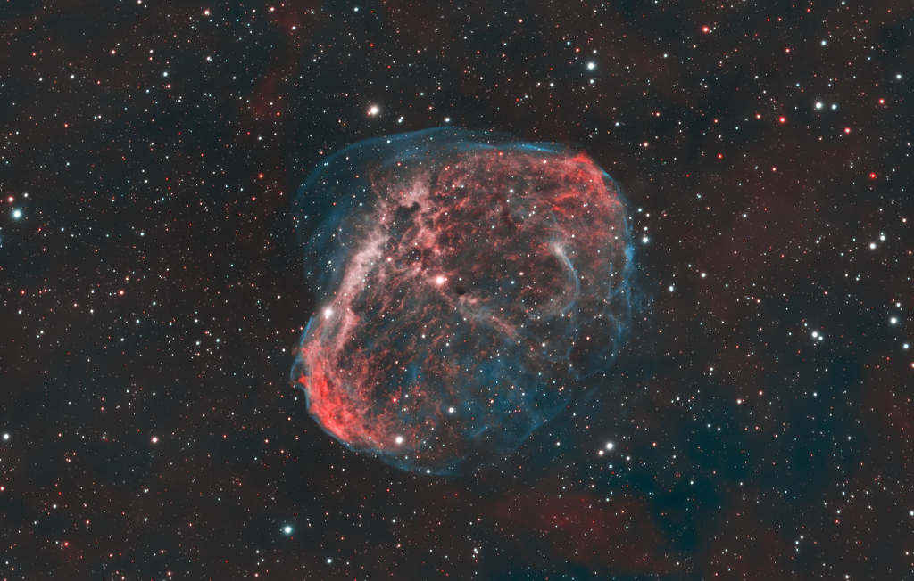

# Workshop initiation au Ruby 

## Introduction

>Ruby est un langage de programmation libre. Il est interprété, orienté objet et multi-paradigme. Le langage a été standardisé au Japon en 2011 (JIS X 3017:2011), et en 2012 par l'Organisation internationale de normalisation (ISO 30170:2012).
>
> Wikipedia

## Instalation

* __apt__ _(debian/ubuntu)_ :

    ```sh
    sudo apt-get install ruby-full
    ```

* __yum__ _(CentOS, Fedora, ou RHEL)_ :

    ```sh
    sudo yum install ruby
    ```

* __pacman__ _(Arch Linux)_ :

    ```sh
    sudo pacman -S ruby
    ```

* __Homebrew__ _(macOS)_ :

    ```sh
    brew install ruby
    ```

Pour vérifier si vous avez bien installer ruby, vous pouvez faire la commande suivante:

```sh
$> ruby --version
ruby 2.7.2p137 (2020-10-01 revision 5445e04352) [x86_64-linux-gnu]
$> irb --version
irb 1.2.6 (2020-09-14)
```

Si vous avez des outputs qui ressemblent à ceux ci dessus, vous avez réussi!

## IRB

IRB veut dire _interactive Ruby_. C'est un outil qui permet d'éxecuter du code en Ruby depuis une ligne de commande.

Pour commencer, lancer IRB:

```sh
$> irb
```

Vous devriez avoir l'affichage suivant:

```sh
$> irb
irb(main):001:0>
```

### Les fonctions

Maintenant essayez de faire:

* L'addition, la multiplication, la puissance et la racine carrée entre 3 et 5

* Une fonction appellée `say_hello` qui prend une `string` en parametre et qui va afficher `Hello <str>` avec un retour
  a la ligne.

* Une fonction appellée qui prend une `string` en parametre et qui va afficher `HELLO <str>` avec `str` en `majuscules`
  suivit d'un retour a la ligne.

* Une fonction appellée `say_hello_to_someone` qui va afficher :

    * `Hello someone` si aucun paramètre n'est donné.

    * `Hello <str>` avec `<str>` étant le paramètre.

* Une fonction appellée `print_list` qui prend une liste et qui affiche tous ses éléments, un par ligne.

### Les classes

Le ruby est un langage orienté objet. Il est donc posible de faire des classes.

Les classes sont faites de la façon suivante:

```rb

class Nom # Nom de l'objet (doit commencer par une majuscule)
  def initialize()
    # Constructer de l'objet
    @var #variable de l'objet
  end

  def methode()
    # Méthode de l'objet
    # Code
  end

  def plop()
    # Autre méthode de l'objet
    # Code
  end
end
```

Toujours dans irb, essayez de faire une classe appellée `Dog` qui contient:

* Un nom, qui par defaut est "Plopi"

* Une méthode `bark` qui donne les outputs suivants:

    ```sh
    irb(main):001:0> mon_chien.bark()
    BARK!
    irb(main):002:0> mon_chien.bark(3)
    BARK!
    BARK!
    BARK!
    ```

* Une méthode `say_hi_to` qui donne l'output suivant:

    ```sh
    irb(main):001:0> mon_chien.say_hi_to("Jeanbon")
    Plopi says hi to Jeanbon
    ```

## Les scripts

Le ruby est un langage qui permet d'écrire des scripts.

1) Créer un fichier `first_script`
2) Dans ce fichier ecrire un script qui va lire un nombre donné par l'utilisateur et reverse ce nombre.

```sh
$> ./first_script
Enter a number: 1234
4321
$> ./first_script
Enter a number: AZERTY
invalid value for Integer(): "AZERTY\n"
```

## API

Dans cette partie vous allez voir comment faire une [requette http en ruby](https://ruby-doc.org/stdlib-2.6.5/libdoc/net/http/rdoc/Net/HTTP.html) et traiter la réponse en ruby.

Vous allez faire la requette suivante `GET https://api.nasa.gov/planetary/apod` sur [l'api de la NASA](https://api.nasa.gov/).

>Utilisez api_key=DEMO_KEY pour faire le call

Vous devez faire un script nommé `call_api` qui va:

1) lire une date sur l'entrée standard.
2) Get la response de l'api en fonction de cette date (YYYY-MM-DD).
3) Telecharger l'image et la sauvegarder dans un fichier nommé `result.png`
4) Afficher `l'auteur`, `le titre`, `la description` ainsi que l'image.


**Pour afficher l'image vous aurrez besoin de lancer la commande shell [`viu`](https://github.com/atanunq/viu) depuis votre script**

> vous aurez besoin d'utiliser [kitty term] pour afficher l'image en haute definition.

Vous devriez avoir l'affichage suivant:

```shell
$> ./call_api
Enter a date (YYYY-MM-DD):
2021-06-17
```

Author:
Joe Navara

Title:
NGC 6888: The Crescent Nebula

Description:
NGC 6888, also known as the Crescent Nebula, is a about 25 light-years across blown by winds from its central, bright, massive star. A triumvirate of astroimagers ( Joe, Glenn, Russell) created this sharp portrait of the cosmic bubble. Their telescopic collaboration collected over 30 hours of narrow band image data isolating light from hydrogen and oxygen atoms. The oxygen atoms produce the blue-green hue that seems to enshroud the detailed folds and filaments. Visible within the nebula, NGC 6888's central star is classified as a Wolf-Rayet star (WR 136). The star is shedding its outer envelope in a strong stellar wind, ejecting the equivalent of the Sun's mass every 10,000 years.  The nebula's complex structures are likely the result of this strong wind interacting with material ejected in an earlier phase. Burning fuel at a prodigious rate and near the end of its stellar life this star should ultimately go out with a bang in a spectacular supernova explosion. Found in the nebula rich constellation Cygnus, NGC 6888 is about 5,000 light-years away.

<p align="center">
  
</p>

## Contributors

- Antoine Desruet [![github-link][github-logo]](https://github.com/antwxne)


<!-- Markdown link & img definition's -->

[Github-logo]: https://img.shields.io/badge/GitHub-100000?style=for-the-badge&logo=github&logoColor=white