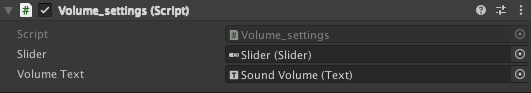

# Workshop Unity Menu 

## Introduction

Dans ce workshop vous allez apprendre à faire un menu en 2D avec unity.

Il va vous permettre de vous familiariser avec Unity. 

Le but est de pouvoir réutiliser ce que vous ferez dans ce workshop pour pouvoir faire un jeu complet.

Vous retrouverez des images et des sons dans `Assets.zip` si vous ne souhaitez pas en chercher.

## Setup

### Version d'Unity

Pour ce workshop nous utiliserons la version `2020.03.25f1 (LTS)`


### Creation du projet

Sélectionnez `2D`, un nom de projet et le dossier dans lequel vous voulez enregistrer le projet.


### Mettre un fond

Pour commencer prenez une image de votre choix. Glissez-la dans le dossier `Assets`. 
Ensuite glissez la dans l'éditeur, de sorte que votre image tienne dans le rectangle de votre caméra.


### Mettre un titre

Ajoutez un titre à votre menu.

Pour se faire créez un `Text`, `Clic droit->UI->Text`.

Ensuite placez le texte où vous souhaitez afficher le titre sur le menu.

Vous pouvez modifier le contenu, la font, la couleur et la taille du texte si vous le souhaitez.


## Premier bouton

Vous allez faire un premier bouton qui servira à lancer une partie.

### Bouton

Comme pour le texte, vous pouvez créer un bouton en faisant `clic droit->UI->Bouton`. Place-le ou vous le souhaitez sur le canva et modifiez son texte.


### États du bouton

Vous voudrez sans doutes changer la couleur du bouton lorsque vous passez la souris dessus ou encore lorsque vous cliquez.

Vous pouvez changer ces caractéristiques dans l'onglet `button` de votre bouton.


## Entrer un nom

Pour pouvoir entrer un nom il va vous falloir un `Input field` que vous pouvez retrouver en faisant `clic droit->UI->Input Field` et placez le ou vous voulez.


En suite vous pouvez modifier les caractéristiques de l'input field si vous le souhaitez.

### Sauvegarder le nom

Pour commencer créez un dossier `scripts` dans `Assets` et copiez-y le script `setting.cs`.

Ce script contient une classe qui servira à stocker les valeurs de nos options de jeu.

Ainsi ces options seront disponibles entre les scenes.

Ensuite créez un `Game Object Vide` qui contiendra un `nouveau script` qui va venir sauvegarder le nom entré dans `l'input field`.

```c#
using UnityEngine;

public class SaveName : MonoBehaviour
{
    public GameObject InputField;

    public void Save()
    {
        // prendre la string de l'input field et la stocker dans la classe Settings
    }
}
```

Une fois le script complété, glissez le component `Text` de l'input field:


Dans votre script


Une fois cela terminé, allez dans les paramètres de votre input field et glissez le `GameObject vide` que vous venez de créer puis choisissez la fonction qui sera appelée quand vous aurez fini d'entrer du texte.
> Dans votre cas la fonction à appeler sera la methode _Save_ de la classe _SaveName_


Pour que le nom reste affiché dans l'input field quand vous changez de scène, vous pouvez créer un script que vous attachez
à votre input field.

Complétez le script suivant:

```c#
using UnityEngine;
using UnityEngine.UI;

public class Handle_name : MonoBehaviour
{
    void Start()
    {
        // Changez le text de votre input field par le nom du joueur
    }
}
```

## Musique et sons

Pour rendre votre menu plus agréable, vous pouvez ajouter de la musique de fond et des sons lorsque vous cliquez sur un bouton.

### Musique

L'ajout de musique avec Unity est assez simple. Vous devez juste créer une source audio `click droit->audio->Audio source` et ensuite glisser la musique que vous souhaitez dans `Audio clip`.


> Vous pourrez retrouver une musique pour votre menu dans `Assets/Sounds`.

### Sons

Pour ajouter un son lors d'un clic.

Créez une nouvelle source audio, `click droit->audio->Audio source`, glissez-y le son que vous voulez, comme pour la musque.

__Attention, cette fois ci il faut penser à désactiver l'option `Play On Awake`.__


Maintenant que votre son est créé, il ne reste plus qu'à l'associer à l'évènement `Click` d'un bouton.


Dans les paramètres du bouton auquel vous voulez ajouter un son, glissez l'`audio source` de votre son et ensuite sélectionnez la méthode `Play`.

## Options

Maintenant que vous avez votre menu principal, vous aurez peut-être besoin d'un menu d'options. C'est ce que vous allez faire dans cette partie.

Pour ce faire, vous allez avoir besoin d'une nouvelle `Scène` qui servira de menu d'options. Dans le dossier `Scenes` créez une nouvelle scène `click droit->create->scene`.

Créez un bouton `Options` qui servira à changer de scène.

Ensuite créez un `Empty Game Object` et attachez-y un `Nouveau script`.

Contenu du script:

```c#
using System.Collections;
using System.Collections.Generic;
using UnityEngine;
using UnityEngine.SceneManagement;

public class Change_Scene : MonoBehaviour
{
    public void ChangeScene(string nextScene)
    {
        // Changement de scene
    }
}

```

Une fois le script complété, ajoutez l'`Empty Game Object` à l'action `OnClick` du bouton `Options` et sélectionnez la méthode `ChangeScene`.


> Vous changerez _< nom de la scene >_ par le nom de votre scène.

### Couper le son

Créez un bouton de forme carré. Ensuite glissez l'image `Sound` dans `Source Image` et mettez un texte vide dans le bouton.


Créez un `Nouveau script` qui servira à mettre à jour la `Classe Settings` qui continent nos paramètres.
Vous mettrez ce script sur le bouton.

Complétez le script suivant:

```c#
using UnityEngine;
using UnityEngine.UI;

public class HandleSoundSSettings : MonoBehaviour
{
    public Sprite soundImageON; // Le sprite à afficher quand le son est activé
    public Sprite soundImageOFF; // Le sprite à afficher quand le son est désactivé
    
    void Start()
    {
        GetComponent<Button>().onClick.AddListener(StopSound);
        // Changer le sprite du bouton,
        // Si le son est activé choisir un sprite, sinon en choisir un autre.
    }

    void StopSound()
    {
        // Changer la valeur Settings.soundOn.
        // Changer le sprite du bouton.
    }
}
```

Une fois le script complété, retournez dans la scene de votre menu principal.

Regroupez vos sons dans un `Empty Game Object`.


Attachez un `nouveau script` au game object qui contient vos sons.

```c#
using UnityEngine;

public class HandleSounds : MonoBehaviour
{
    void Start()
    {
        var children = GetComponentsInChildren<AudioSource>();
        
        foreach (var child in children)
        {
            // Activez ou non le child
            // en fonction de la valeur de soundOn.
        }
    }
}
```

Maintenant quand vous changerez de scene, le son sera activé ou non.

### Changer le volume

Pour changer le volume vous allez utiliser un `Slider`.

Une fois le slider créé, créez un `Text` qui servira à afficher le pourcentage du volume actuel.

Ensuite attaché un `Nouveau script` à votre slider.

Complétez le script suivant:

```c#
using UnityEngine;
using UnityEngine.UI;

public class Volume_settings : MonoBehaviour
{
    public Slider slider; // Votre slider
    public Text volumeText; // Le texte qui va afficher le volume

    void Start()
    {
        // Changer la valeur du slider par la valeur de volume dans la classe Settings
        // Changer le text de volumeText par "Volume: <valeur du volume>%".
    }

    public void ChangeVolume()
    {
        // Changer la valeur de volume dans les settings par la valeur du slider.
        // Changer le text de volumeText par "Volume: <valeur du volume>%".
    }
}
```

Une fois le script complété, glissez votre `Slider` et votre `Text` dans le script.



Ensuite ajoutez la méthode `ChangeVolume` à l'évènement `OnValueChanged`.


N'oubliez pas de mettre à jour le volume de tous vos sons. Vous pouvez modifier le script que vous aviez fait pour couper tous vos sons.

```c#
using UnityEngine;

public class HandleSounds : MonoBehaviour
{
    void Start()
    {
        var children = GetComponentsInChildren<AudioSource>();
        
        foreach (var child in children)
        {
            // Activez ou non le child
            // en fonction de la valeur de soundOn.
            // Changer le volume du son
        }
    }
}
```

> Vous voici à la fin du workshop félicitation!

## Contributeurs

- Maxime Dodin [![github-link][github-logo]](https://github.com/maxime-dodin)
- Antoine Desruet [![github-link][github-logo]](https://github.com/antwxne)

<!-- Useful links -->
[Github-logo]: https://img.shields.io/badge/GitHub-100000?style=for-the-badge&logo=github&logoColor=white

